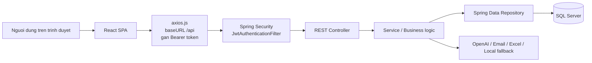
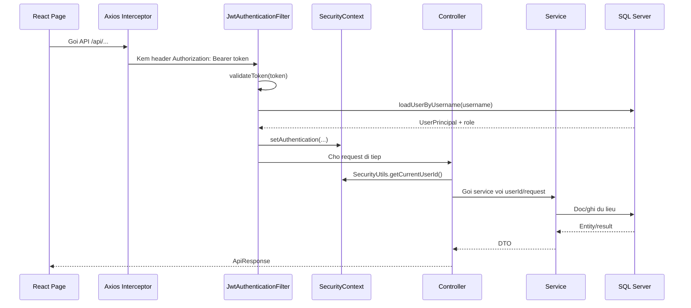
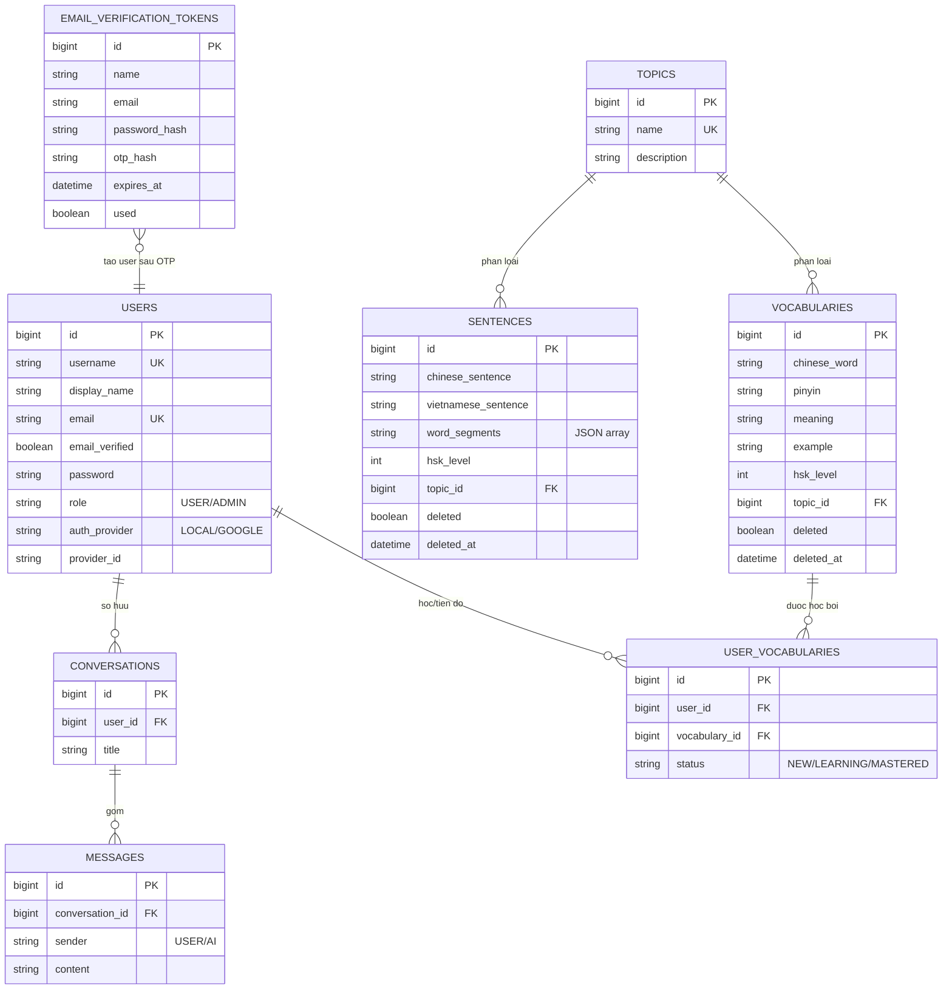

# Phan tich luong chay va quan he du lieu Hanzii

Tai lieu nay tom tat luong chay chinh cua source fullstack Hanzii. Source gom React frontend, Spring Boot backend, SQL Server database, JWT security, va mot so tich hop AI/Excel.

Ghi chu: mot so chuoi tieng Viet trong source dang bi loi encoding hien thi, vi du `Chính xác`. Loi nay nam o text message, khong lam thay doi logic chay.

## 1. Kien truc tong quan



Frontend co cac trang: Login, Register, Vocabulary, Test, Sentence, Chat, Handwriting, Admin. Moi trang goi API thong qua `frontend/src/api/services.js`. `axios.js` tu dong lay `token` tu `localStorage`, gan header `Authorization: Bearer ...`; neu backend tra 401 thi xoa token va chuyen ve `/login`.

Backend chia lop theo pattern quen thuoc:

- `controller`: nhan request, lay param/body, tra `ApiResponse`.
- `service`: xu ly nghiep vu, transaction, goi repository hoac external API.
- `repository`: thao tac DB bang Spring Data JPA.
- `entity`: mapping bang SQL.
- `specification`: tao dieu kien query dong cho filter/search.
- `security`: JWT, principal, user details.
- `mapper`: map entity sang DTO response.

## 2. Luong request chung co JWT



Quyen truy cap trong `SecurityConfig`:

- Public: `/api/auth/**`, `/api/health`.
- Chi ADMIN: `/api/admin/**`.
- Con lai: moi `/api/**` deu can dang nhap.

## 3. So do quan he du lieu



Tat ca entity ke thua `AuditableEntity`, nen co them `created_at`, `updated_at`, `created_by`, `last_modified_by`. `AuditingConfig` lay username dang dang nhap lam nguoi tao/sua, neu khong co thi dung `system`.

## 4. Luong Auth

### 4.1 Dang ky bang email va OTP

Endpoint:

- `POST /api/auth/register`
- `POST /api/auth/register/verify`

Luong:

1. `RegisterPage` goi `authApi.register`.
2. `AuthController.requestRegistrationOtp` nhan `RegisterRequest`.
3. `AuthService.requestRegistrationOtp` normalize email, kiem tra `users.email` da ton tai chua.
4. Tao OTP 6 so, hash password va hash OTP bang BCrypt.
5. Luu vao `email_verification_tokens` voi han 10 phut.
6. `EmailService.sendRegistrationOtp` gui OTP.
7. Khi user nhap OTP, frontend goi `/register/verify`.
8. `AuthService.verifyRegistrationOtp` lay token moi nhat `used=false`, check het han, check OTP.
9. Set token `used=true`.
10. Tao record trong `users` voi role `USER`, provider `LOCAL`, email verified.
11. Sinh JWT bang `JwtTokenProvider`.
12. Frontend luu token + user vao `localStorage`.

### 4.2 Dang nhap username/email

Endpoint: `POST /api/auth/login`

Luong:

1. Frontend gui `{ username, password }`.
2. `AuthService.login` tim user bang username hoac email.
3. So password bang BCrypt.
4. Neu dung, tao `AuthResponse` gom token, username, email, displayName, role, userId.
5. Frontend luu auth state.

### 4.3 Dang nhap Google

Endpoint: `POST /api/auth/google`

Luong:

1. Frontend gui `idToken`.
2. `GoogleTokenVerifier.verify` xac thuc token va lay thong tin Google user.
3. Neu email da ton tai: cap nhat email verified, provider id, display name neu can.
4. Neu chua ton tai: tao user moi provider `GOOGLE`, password `null`, role `USER`.
5. Tra JWT nhu login thuong.

## 5. Luong Vocabulary

Controller: `VocabularyController`  
Service: `VocabularyService`  
Bang chinh: `vocabularies`, `topics`, `user_vocabularies`

### 5.1 Danh sach tu vung

Endpoint: `GET /api/vocabularies?status=&hsk=&topic=&keyword=&page=&size=`

Luong:

1. `VocabularyPage` goi `vocabularyApi.list(params)`.
2. Backend lay `userId` tu `SecurityUtils`.
3. `VocabularyService.getVocabularies` tao `Specification`:
   - `withFilters`: bo qua record soft-delete, loc HSK, topic, keyword theo Chinese/Pinyin/Meaning.
   - `withStatusFilter`: loc status theo `user_vocabularies`.
4. Query `vocabularies` co join/fetch `topic`, phan trang va sort theo `hskLevel`, `id`.
5. Lay danh sach `vocabIds` trong page.
6. Query `user_vocabularies` cua user de tao map `vocabularyId -> status`.
7. Map sang `VocabularyResponse`; neu user chua co row tien do thi status mac dinh la `NEW`.
8. Tra `PageResponse`.

### 5.2 Thong ke tu vung

Endpoint: `GET /api/vocabularies/stats`

Luong:

1. Dem so tu user da `MASTERED` trong `user_vocabularies`.
2. Dem so tu user da cap nhat trong ngay hien tai dua tren `updatedAt`.
3. Dem tong so tu chua bi soft-delete trong `vocabularies`.
4. Tra `VocabularyStatsResponse`.

### 5.3 Xem chi tiet tu

Endpoint: `GET /api/vocabularies/{id}`

Luong:

1. Tim `Vocabulary` bang `id` va `deleted=false`.
2. Tim status ca nhan trong `user_vocabularies`.
3. Neu khong co tien do thi status `NEW`.
4. Tra response kem topic va status.

### 5.4 Cap nhat trang thai hoc

Endpoint: `PATCH /api/vocabularies/{id}/status?status=LEARNING`

Luong:

1. Kiem tra tu ton tai va chua bi xoa.
2. Tim row `user_vocabularies` theo `userId + vocabularyId`.
3. Neu chua co thi tao row moi.
4. Set status moi: `NEW`, `LEARNING`, hoac `MASTERED`.
5. Save.

## 6. Luong Topic

Endpoint: `GET /api/topics`

Luong:

1. Frontend goi `topicApi.list`.
2. `TopicController.getAll` goi `TopicService.getAllTopics`.
3. Repository doc danh sach topic.
4. Map sang `TopicResponse`.

Topic la bang danh muc dung chung cho tu vung va cau.

## 7. Luong Test tu vung

Controller: `TestController`  
Service: `TestService`

### 7.1 Lay cau hoi

Endpoint: `GET /api/test/questions?hsk=&topic=`

Luong:

1. `TestPage` goi `testApi.getQuestions`.
2. `TestService.getTestQuestions` loc vocabulary theo HSK/topic.
3. Voi moi tu, kiem tra user da `MASTERED` chua.
4. Chi giu tu chua mastered.
5. Tra cau hoi gom `vocabularyId`, meaning tieng Viet, HSK, topic. Khong tra dap an Chinese trong cau hoi.

### 7.2 Nop dap an

Endpoint: `POST /api/test/submit`

Body chinh: `vocabularyId`, `answer`.

Luong:

1. Tim vocabulary theo `vocabularyId`.
2. Normalize dap an user va dap an dung: trim, xoa khoang trang.
3. So sanh voi `vocabulary.chineseWord`.
4. Neu dung: set status `MASTERED`.
5. Neu sai: set status `LEARNING`, nhung neu dang `MASTERED` thi khong ha xuong.
6. Tra `TestResultResponse` gom correct, correctAnswer, feedback, vocabularyId.

## 8. Luong Sentence

Controller: `SentenceController`  
Service: `SentenceService`  
Bang chinh: `sentences`, `topics`, co dung them `vocabularies` de tach tu neu `word_segments` rong.

### 8.1 Danh sach cau

Endpoint: `GET /api/sentence/all?hsk=&topic=&keyword=&searchType=&page=&size=&sortBy=&sortOrder=`

Luong:

1. Tao `SentenceSpecification.filter` de bo soft-delete, loc HSK/topic.
2. Neu co keyword:
   - `searchType=vietnamese`: search trong `vietnameseSentence`.
   - mac dinh: search trong `chineseSentence`.
3. Sort theo id/chinese/vietnamese/hsk/topic/created.
4. Query phan trang.
5. Parse `wordSegments` JSON thanh list neu co.
6. Tra `PageResponse<SentenceResponse>`.

### 8.2 Lay bai sap xep cau

Endpoint:

- `GET /api/sentence/exercises?hsk=&topic=`
- `GET /api/sentence/exercises/{id}`

Luong:

1. Lay sentence theo filter hoac id.
2. `toExercise` goi `resolveWordSegments`.
3. Neu `sentences.word_segments` co JSON hop le thi dung luon.
4. Neu khong co, lay tat ca `vocabularies.chineseWord` lam tu dien da biet.
5. Goi `ChineseWordSegmenter.segment(chineseSentence, knownWords)` de tach cau.
6. Copy list va `Collections.shuffle`.
7. Tra Vietnamese sentence + list tu da xao tron cho frontend keo tha.

### 8.3 Kiem tra sap xep

Endpoint: `POST /api/sentence/check`

Luong:

1. Lay sentence theo `sentenceId`.
2. Normalize cau user sap xep va cau dung: trim, xoa khoang trang.
3. So sanh chuoi.
4. Tra correct, correctSentence, feedback.

## 9. Luong Chat AI

Controller: `ChatController`  
Service: `ChatService`, `ChatPersistenceService`, `AiTutorTaskService`, `OpenAiService`  
Bang chinh: `conversations`, `messages`

### 9.1 Gui tin nhan

Endpoint: `POST /api/chat`

Body: `message`, optional `conversationId`.

Luong:

1. `ChatPage` gui tin nhan.
2. `ChatService.sendMessage` goi `ChatPersistenceService.saveUserMessage`.
3. Neu co `conversationId`: tim conversation cua dung user.
4. Neu khong co: tao conversation moi cho user.
5. Luu message sender `USER`.
6. Build history tu tat ca message trong conversation theo createdAt tang dan.
7. Goi `AiTutorTaskService.chatAsync(...).join()`.
8. `OpenAiService.chat`:
   - Neu khong co API key hop le: dung `LocalAiTutorService`.
   - Neu co API key: goi `/chat/completions` voi system prompt day tieng Trung cho hoc vien Viet.
   - Neu OpenAI loi: fallback ve local tutor.
9. Luu message sender `AI`.
10. Neu conversation chua co title, lay user message dau tien cat 50 ky tu lam title.
11. Tra `ChatResponse` gom conversationId, userMessage, aiMessage.

### 9.2 Lich su conversation

Endpoints:

- `GET /api/chat/conversations`
- `GET /api/chat/conversations/{id}`
- `DELETE /api/chat/conversations/{id}`

Luong:

1. Luon loc theo `userId`, nen user khong doc/xoa conversation cua user khac.
2. List sort `updatedAt desc`.
3. Fetch conversation kem messages bang `@EntityGraph`.
4. Delete conversation se cascade/orphan remove messages.

## 10. Luong Handwriting

Endpoint: `POST /api/handwriting/check`

Luong:

1. Frontend gui `expectedCharacter`, `recognizedCharacter` neu co, va/hoac `drawnData`.
2. `HandwritingService` normalize ky tu mong doi va ky tu nhan dang.
3. Neu khong co input ve net ve va khong co recognizedCharacter: tra incorrect, confidence 0.
4. Neu co canvas data nhung khong recognized duoc: tra confidence 0.3.
5. Neu recognized trung khop: correct true, confidence 0.95.
6. Neu recognized co chua expected hoac expected chua recognized: gan dung tuong doi, confidence 0.7.
7. Con lai: incorrect, confidence 0.2.

Hien tai backend khong tu OCR hinh anh; no danh gia dua tren `recognizedCharacter` ma frontend/gui ngoai cung cap.

## 11. Luong Admin

Admin API yeu cau role `ADMIN`.

### 11.1 Quan ly vocabulary

Endpoints:

- `GET /api/admin/vocabularies`
- `GET /api/admin/vocabularies/{id}`
- `POST /api/admin/vocabularies`
- `PUT /api/admin/vocabularies/{id}`
- `DELETE /api/admin/vocabularies/{id}`

Luong:

1. List dung `VocabularySpecification.withFilters`.
2. Create/update tim topic theo `topicId`, trim input, save vocabulary.
3. Delete la soft-delete: set `deleted=true`, `deletedAt=now`.
4. User vocabulary progress khong bi xoa khi soft-delete vocabulary, nhung API user se khong thay tu da xoa.

### 11.2 Quan ly sentence

Endpoints:

- `GET /api/admin/sentences`
- `GET /api/admin/sentences/{id}`
- `POST /api/admin/sentences`
- `PUT /api/admin/sentences/{id}`
- `DELETE /api/admin/sentences/{id}`
- `POST /api/admin/sentences/segment`

Luong:

1. List loc HSK/topic, bo soft-delete.
2. Create/update tim topic.
3. Neu request co `wordSegments` thi dung list do.
4. Neu khong co, auto segment bang `ChineseWordSegmenter` dua tren tu vung hien co.
5. Serialize segments thanh JSON string luu vao `sentences.word_segments`.
6. Delete la soft-delete.

### 11.3 Import Excel vocabulary

Endpoints:

- `GET /api/admin/template`
- `POST /api/admin/upload-excel`

Luong:

1. Download template tao file XLSX bang Apache POI.
2. Upload file validate `.xlsx` hoac `.xls`.
3. Doc sheet dau tien, bo header.
4. Moi row lay Chinese, Pinyin, Meaning, Example, HSK Level, Topic.
5. Validate bat buoc Chinese/Pinyin/Meaning, HSK 1-6, gioi han do dai.
6. Topic duoc resolve theo ten; neu chua co thi tao topic moi.
7. Neu da co vocabulary cung `chineseWord + topicId` thi update.
8. Neu chua co thi insert.
9. Tra `ExcelImportResponse`: totalRows, imported, updated, skipped, errors.

### 11.4 Import Excel sentence

Endpoints:

- `GET /api/admin/sentence-template`
- `POST /api/admin/upload-sentence-excel`

Luong:

1. Download template cau bang Apache POI.
2. Upload file va validate dinh dang.
3. Moi row lay Chinese Sentence, Vietnamese Sentence, HSK Level, Topic.
4. Validate bat buoc Chinese/Vietnamese, HSK 1-6, gioi han do dai.
5. Resolve topic theo ten, tao moi neu can.
6. Neu da co `chineseSentence` thi update.
7. Neu chua co thi insert.
8. Khi save sentence, auto segment va luu `word_segments`.

## 12. Luong Realtime

Endpoint: `POST /api/realtime/session`

Luong:

1. Client gui SDP offer dang `text/plain` hoac `application/sdp`.
2. `RealtimeController.createSession` goi `RealtimeService.createCall`.
3. Service tao session/call voi provider realtime va tra SDP answer.

Chuc nang nay can xem them cau hinh API key/provider trong `RealtimeService` va `application.yml` khi debug thuc te.

## 13. Luong frontend theo route

```mermaid
flowchart TD
    App[App.jsx Routes] --> PublicLogin[/login LoginPage]
    App --> PublicRegister[/register RegisterPage]
    App --> Private[PrivateRoute + MainLayout]
    Private --> Vocabulary[/vocabulary VocabularyPage]
    Private --> Test[/test TestPage]
    Private --> Sentence[/sentence SentencePage]
    Private --> Chat[/chat ChatPage]
    Private --> Handwriting[/handwriting HandwritingPage]
    Private --> AdminGuard[AdminRoute]
    AdminGuard --> Admin[/admin AdminPage]

    Login --> AuthApi[authApi]
    Register --> AuthApi
    Vocabulary --> VocabularyApi[vocabularyApi + topicApi]
    Test --> TestApi[testApi + topicApi]
    Sentence --> SentenceApi[sentenceApi + topicApi]
    Chat --> ChatApi[chatApi]
    Handwriting --> HandwritingApi[handwritingApi]
    Admin --> AdminApi[adminApi + topicApi]
```

## 14. Cac diem can nho khi doc/debug source

- `NEW` co hai nghia:
  - Co row `user_vocabularies.status = NEW`.
  - Hoac user chua co row nao voi vocabulary do. API list van tra `NEW`.
- `MASTERED` trong test duoc bao ve: neu user da mastered ma submit sai lai, code khong ha xuong `LEARNING`.
- `deleted` la soft-delete cho `Vocabulary` va `Sentence`; cac query chinh deu bo qua record da xoa.
- `word_segments` cua sentence la JSON string, khong phai bang con.
- `Conversation` thuoc ve `User`; moi thao tac get/delete conversation deu check `userId`.
- Dang ky local khong tao user ngay lap tuc; user chi duoc tao sau khi verify OTP.
- `DataSeeder` chi chay khi profile `dev`, tao user mac dinh admin/user neu chua ton tai.
- OpenAI chat co fallback local khi thieu API key hoac API loi.

## 15. Bang mapping nhanh API -> code -> bang du lieu

| Chuc nang | Endpoint | Controller | Service | Bang chinh |
|---|---|---|---|---|
| Dang ky OTP | `POST /api/auth/register` | `AuthController` | `AuthService` | `email_verification_tokens` |
| Xac thuc OTP | `POST /api/auth/register/verify` | `AuthController` | `AuthService` | `email_verification_tokens`, `users` |
| Dang nhap | `POST /api/auth/login` | `AuthController` | `AuthService` | `users` |
| Google login | `POST /api/auth/google` | `AuthController` | `AuthService` | `users` |
| Danh sach tu | `GET /api/vocabularies` | `VocabularyController` | `VocabularyService` | `vocabularies`, `topics`, `user_vocabularies` |
| Trang thai tu | `PATCH /api/vocabularies/{id}/status` | `VocabularyController` | `VocabularyService` | `user_vocabularies` |
| Topic | `GET /api/topics` | `TopicController` | `TopicService` | `topics` |
| Cau hoi test | `GET /api/test/questions` | `TestController` | `TestService` | `vocabularies`, `user_vocabularies` |
| Nop test | `POST /api/test/submit` | `TestController` | `TestService` | `user_vocabularies` |
| Bai cau | `GET /api/sentence/exercises` | `SentenceController` | `SentenceService` | `sentences`, `vocabularies` |
| Check cau | `POST /api/sentence/check` | `SentenceController` | `SentenceService` | `sentences` |
| Chat | `POST /api/chat` | `ChatController` | `ChatService` | `conversations`, `messages` |
| Handwriting | `POST /api/handwriting/check` | `HandwritingController` | `HandwritingService` | Khong ghi DB |
| Admin vocabulary | `/api/admin/vocabularies/**` | `AdminController` | `AdminVocabularyService` | `vocabularies`, `topics` |
| Admin sentence | `/api/admin/sentences/**` | `AdminController` | `AdminSentenceService` | `sentences`, `topics` |
| Import Excel | `/api/admin/upload-*` | `AdminController` | `ExcelImportService` | `vocabularies`, `sentences`, `topics` |

